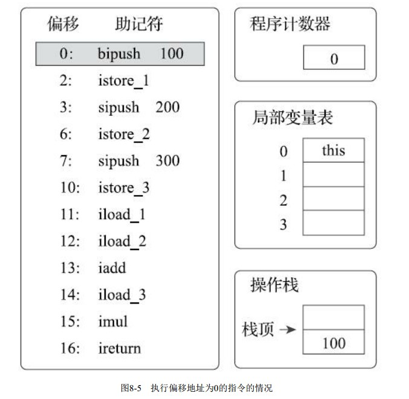
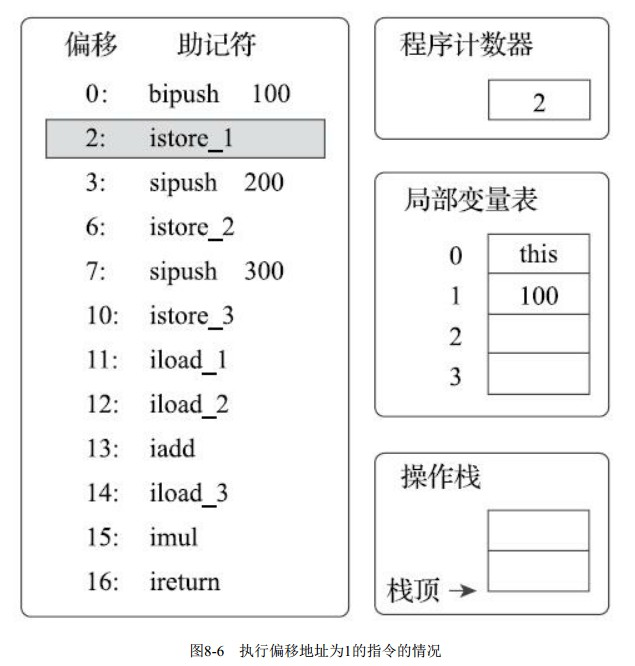
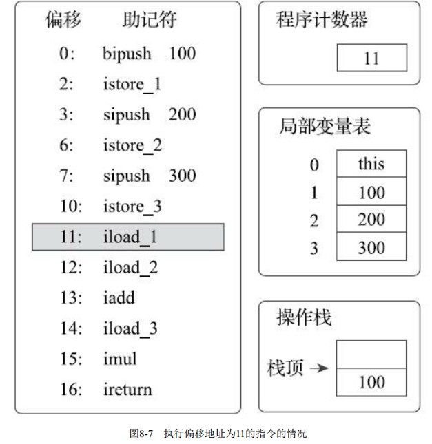
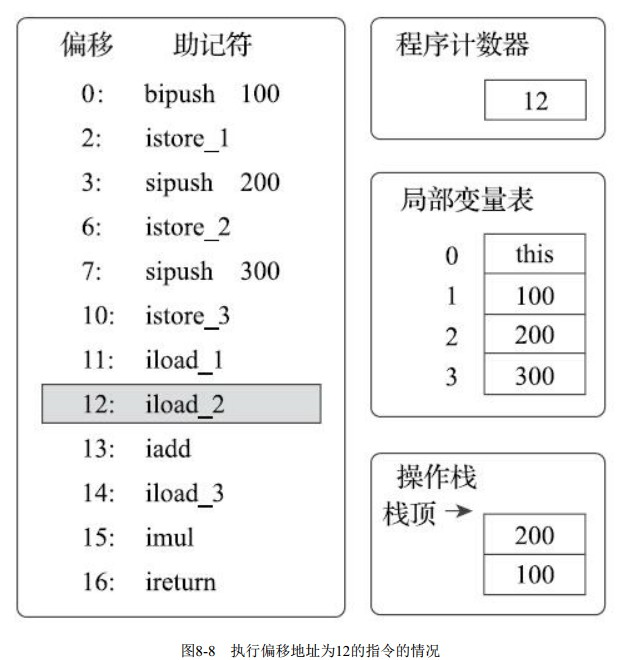
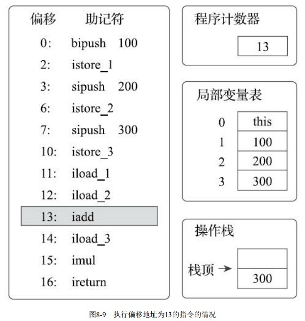
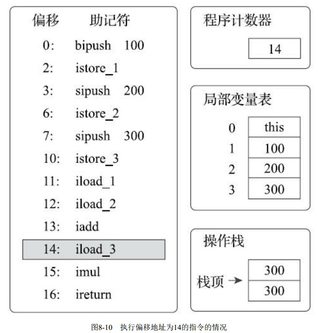
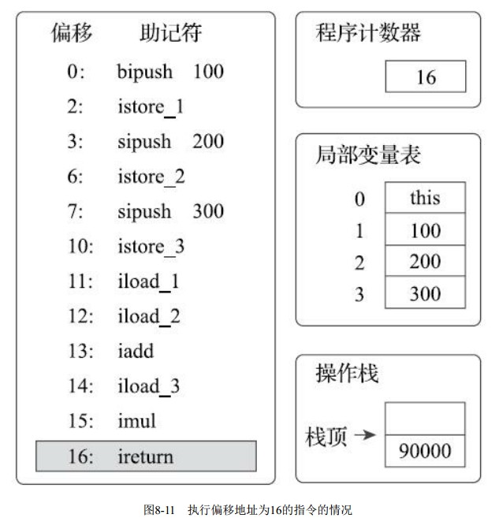

# 源代码
```java
public class Hello {
    public int calc() {
        int a = 100;
        int b = 200;
        int c = 300;
        return (a + b) * c;
    }
    
    public static void main(String[] args) {
        int tmp = 1;
        //if和for
        if (tmp == 1) {
            for (int i = 0; i < 2; i++) {
                System.out.println("hello");
            }
        }
    }
}
```
# 字节码
```shell script
E:\JAVA-000\Week_01\src\main\java\com\zhi\homework1>javap -c Hello.class
Compiled from "Hello.java"
public class com.zhi.homework1.Hello {
  public com.zhi.homework1.Hello();
    Code:
       0: aload_0
       1: invokespecial #1                  // Method java/lang/Object."<init>":()V
       4: return

  public int calc();
    Code:
       0: bipush        100
       2: istore_1
       3: sipush        200
       6: istore_2
       7: sipush        300
      10: istore_3
      11: iload_1
      12: iload_2
      13: iadd
      14: iload_3
      15: imul
      16: ireturn

  public static void main(java.lang.String[]);
    Code:
       0: iconst_1
       1: istore_1
       2: iload_1
       3: iconst_1
       4: if_icmpne     28
       7: iconst_0
       8: istore_2
       9: iload_2
      10: iconst_2
      11: if_icmpge     28
      14: getstatic     #2                  // Field java/lang/System.out:Ljava/io/PrintStream;
      17: ldc           #3                  // String hello
      19: invokevirtual #4                  // Method java/io/PrintStream.println:(Ljava/lang/String;)V
      22: iinc          2, 1
      25: goto          9
      28: return
}
```

```shell script
E:\JAVA-000\Week_01\src\main\java\com\zhi\homework1>javap -c -verbose Hello.class
Classfile /E:/JAVA-000/Week_01/src/main/java/com/zhi/homework1/Hello.class
  Last modified 2020-10-18; size 282 bytes
  MD5 checksum 1b2cc4f0b204dddd9a50f2fc95501b73
  Compiled from "Hello.java"
public class com.zhi.homework1.Hello
  minor version: 0
  major version: 52
  flags: ACC_PUBLIC, ACC_SUPER
Constant pool:
   #1 = Methodref          #3.#12         // java/lang/Object."<init>":()V
   #2 = Class              #13            // com/zhi/homework1/Hello
   #3 = Class              #14            // java/lang/Object
   #4 = Utf8               <init>
   #5 = Utf8               ()V
   #6 = Utf8               Code
   #7 = Utf8               LineNumberTable
   #8 = Utf8               calc
   #9 = Utf8               ()I
  #10 = Utf8               SourceFile
  #11 = Utf8               Hello.java
  #12 = NameAndType        #4:#5          // "<init>":()V
  #13 = Utf8               com/zhi/homework1/Hello
  #14 = Utf8               java/lang/Object
{
  public com.zhi.homework1.Hello();
    descriptor: ()V
    flags: ACC_PUBLIC
    Code:
      stack=1, locals=1, args_size=1
         0: aload_0
         1: invokespecial #1                  // Method java/lang/Object."<init>":()V
         4: return
      LineNumberTable:
        line 9: 0

  public int calc();
    descriptor: ()I
    flags: ACC_PUBLIC
    Code:
      stack=2, locals=4, args_size=1
         0: bipush        100
         2: istore_1
         3: sipush        200
         6: istore_2
         7: sipush        300
        10: istore_3
        11: iload_1
        12: iload_2
        13: iadd
        14: iload_3
        15: imul
        16: ireturn
      LineNumberTable:
        line 11: 0
        line 12: 3
        line 13: 7
        line 14: 11

  public static void main(java.lang.String[]);
    descriptor: ([Ljava/lang/String;)V
    flags: ACC_PUBLIC, ACC_STATIC
    Code:
      stack=2, locals=3, args_size=1
         0: iconst_1
         1: istore_1
         2: iload_1
         3: iconst_1
         4: if_icmpne     28
         7: iconst_0
         8: istore_2
         9: iload_2
        10: iconst_2
        11: if_icmpge     28
        14: getstatic     #2                  // Field java/lang/System.out:Ljava/io/PrintStream;
        17: ldc           #3                  // String hello
        19: invokevirtual #4                  // Method java/io/PrintStream.println:(Ljava/lang/String;)V
        22: iinc          2, 1
        25: goto          9
        28: return
      LineNumberTable:
        line 19: 0
        line 21: 2
        line 22: 7
        line 23: 14
        line 22: 22
        line 26: 28
      StackMapTable: number_of_entries = 2
        frame_type = 253 /* append */
          offset_delta = 9
          locals = [ int, int ]
        frame_type = 250 /* chop */
          offset_delta = 18
}
SourceFile: "Hello.java"
```

# 分析字节码通用部分
```shell script
E:\JAVA-000\Week_01\src\main\java\com\zhi\homework1>javap -c -verbose Hello.class
Classfile /E:/JAVA-000/Week_01/src/main/java/com/zhi/homework1/Hello.class
  # 编译时间
  Last modified 2020-10-18; size 282 bytes
  # MD5校验和
  MD5 checksum 1b2cc4f0b204dddd9a50f2fc95501b73
  Compiled from "Hello.java"
public class com.zhi.homework1.Hello
  # 指明版本的Java语言规范
  minor version: 0
  major version: 52
  # 访问标志符，ACC_PUBLIC表明这个类是 public 类， JDK1.0 的BUG修正中引入
  # ACC_SUPER 标志来修正 invokespecial 指令调用 super 类方法的问题，从 Java1.1 开始， 编译器一般都会自动生成 ACC_SUPER 标志
  flags: ACC_PUBLIC, ACC_SUPER
# 常量池，大多数时候指的是 运行时常量池 ，由class 文件中的 常量池结构体 组成的。
# #1, #2, #3 这样的编号是对常量池的引用。
Constant pool:
# 解读第一行为例：
# #1 常量编号, 该文件中其他地方可以引用， = 等号就是分隔符.
# Methodref 表明这个常量指向的是一个方法；具体是哪个类的哪个方法呢?
# 类指向的 #6即java/lang/Object , 
# 方法签名指向的 #16 即"<init>":()V
# 总结一下，常量池就是一个常量的大字典，使用编号的方式把程序里用到的各类常量统一管理起来，这样在字节码操作里，只需要引用编号即可。
   #1 = Methodref          #3.#12         // java/lang/Object."<init>":()V
   #2 = Class              #13            // com/zhi/homework1/Hello
   #3 = Class              #14            // java/lang/Object
   #4 = Utf8               <init>
   #5 = Utf8               ()V
   #6 = Utf8               Code
   #7 = Utf8               LineNumberTable
   #8 = Utf8               calc
   #9 = Utf8               ()I
  #10 = Utf8               SourceFile
  #11 = Utf8               Hello.java
  #12 = NameAndType        #4:#5          // "<init>":()V
  #13 = Utf8               com/zhi/homework1/Hello
  #14 = Utf8               java/lang/Object
{
  public com.zhi.homework1.Hello();
    descriptor: ()V
    flags: ACC_PUBLIC
    Code:
# 可以看到无参构造函数的参数个数不是0，这是因为在 Java 中, 如果是静态方法则没有 this 引用
# 对于非静态方法， this将被分配到局部变量表的第0号槽位中
      stack=1, locals=1, args_size=1
		 # 将this引用存到0号槽位
		 
         0: aload_0
         # invokespecial 指令用来调用某些特殊方法的，init方法，
         # 这段可以理解为该类的实例构造器的声明，由于Main类没有重写构造方法，所以调用的是父类的构造方法。
         # 此处也说明了该类的直接父类是Object。 该方法默认返回值是V, 也就是void，无返回值。		 
         1: invokespecial #1                  // Method java/lang/Object."<init>":()V
         4: return
# LineNumberTable 属性用于描述java源代码行号与字节码行号之间的对应关系。
      LineNumberTable:
        line 9: 0
# 实际上我们一般把一个方法的修饰符+名称+参数类型清单+返回值类型，合在一起叫“方法签名”
  public int calc();
# 方法描述，其中小括号内是入参信息/形参信息,左方括号表述数组,L 表示对象,后面的 java/lang/String 就是类名称
# 小括号后面的 V 则表示这个方法的返回值是 void
#  descriptor: ([Ljava/lang/String;)V
# 这里就是无参，返回值为Int
    descriptor: ()I
# 方法的访问标志也很容易理解 flags: ACC_PUBLIC, 表示public
    flags: ACC_PUBLIC
    Code:
# 可以看到执行该方法时需要的栈(stack)深度是多少，需要在局部变量表中保留多少个槽位, 还有方法的参数个数
# javap提示这段代码需要深度为2的操作数栈和4个变量槽的局部变量空间
      stack=2, locals=4, args_size=1
# 间隔不相等的原因是, 有一部分操作码会附带有操作数, 也会占用字节码数组中的空间。
# 例如， new 就会占用三个槽位: 一个用于存放操作码指令自身，两个用于存放操作数
         0: bipush        100
         2: istore_1
         3: sipush        200
         6: istore_2
         7: sipush        300
        10: istore_3
        11: iload_1
        12: iload_2
        13: iadd
        14: iload_3
        15: imul
        16: ireturn
      LineNumberTable:
        line 11: 0
        line 12: 3
        line 13: 7
        line 14: 11


  public static void main(java.lang.String[]);
    descriptor: ([Ljava/lang/String;)V
    flags: ACC_PUBLIC, ACC_STATIC
    Code:
      stack=2, locals=3, args_size=1
         0: iconst_1
         1: istore_1
         2: iload_1
         3: iconst_1
         4: if_icmpne     28
         7: iconst_0
         8: istore_2
         9: iload_2
        10: iconst_2
        11: if_icmpge     28
        14: getstatic     #2                  // Field java/lang/System.out:Ljava/io/PrintStream;
        17: ldc           #3                  // String hello
        19: invokevirtual #4                  // Method java/io/PrintStream.println:(Ljava/lang/String;)V
        22: iinc          2, 1
        25: goto          9
        28: return
      LineNumberTable:
        line 19: 0
        line 21: 2
        line 22: 7
        line 23: 14
        line 22: 22
        line 26: 28
      StackMapTable: number_of_entries = 2
        frame_type = 253 /* append */
          offset_delta = 9
          locals = [ int, int ]
        frame_type = 250 /* chop */
          offset_delta = 18
}
SourceFile: "Hello.java"
```

# 图解+分析字节码方法执行过程(参考深入Java虚拟机)
每个方法被执行的时候， Java虚拟机都会同步创建一个栈帧[1]（Stack Frame） 用于存储局部变量表、 操作数栈、 动态连接、 方法出口等信
息。 每一个方法被调用直至执行完毕的过程， 就对应着一个栈帧在虚拟机栈中从入栈到出栈的过程


首先， 执行偏移地址为0的指令， Bipush指令的作用是将单字节的整型常量值（-128～127） 推入
操作数栈顶， 跟随有一个参数， 指明推送的常量值， 这里是100


执行偏移地址为2的指令， istore_1指令的作用是将操作数栈顶的整型值出栈并存放到第1个局部变
量槽中。 后续4条指令（直到偏移为11的指令为止） 都是做一样的事情， 也就是在对应代码中把变量
a、 b、 c赋值为100、 200、 300。 这4条指令的图示略过。


执行偏移地址为11的指令， iload_1指令的作用是将局部变量表第1个变量槽中的整型值复制到操作
数栈顶。


执行偏移地址为12的指令， iload_2指令的执行过程与iload_1类似， 把第2个变量槽的整型值入栈。
画出这个指令的图示主要是为了显示下一条iadd指令执行前的堆栈状况。


执行偏移地址为13的指令， iadd指令的作用是将操作数栈中头两个栈顶元素出栈， 做整型加法，
然后把结果重新入栈。 在iadd指令执行完毕后， 栈中原有的100和200被出栈， 它们的和300被重新入
栈。


执行偏移地址为14的指令， iload_3指令把存放在第3个局部变量槽中的300入栈到操作数栈中。 这
时操作数栈为两个整数300。 下一条指令imul是将操作数栈中头两个栈顶元素出栈， 做整型乘法， 然后
把结果重新入栈， 与iadd完全类似， 所以笔者省略图示。


执行偏移地址为16的指令， ireturn指令是方法返回指令之一， 它将结束方法执行并将操作数栈顶
的整型值返回给该方法的调用者。 到此为止， 这段方法执行结束。

上面的执行过程仅仅是一种概念模型， 虚拟机最终会对执行过程做出一系列优化来提高
性能， 实际的运作过程并不会完全符合概念模型的描述。 更确切地说， 实际情况会和上面描述的概念
模型差距非常大， 差距产生的根本原因是虚拟机中解析器和即时编译器都会对输入的字节码进行优
化， 即使解释器中也不是按照字节码指令去逐条执行的。 例如在HotSpot虚拟机中， 就有很多
以“fast_”开头的非标准字节码指令用于合并、 替换输入的字节码以提升解释执行性能， 即时编译器的
优化手段则更是花样繁多.
从这段程序的执行中也可以看出栈结构指令集的一般运行过程， 整个运算过程的中间变
量都以操作数栈的出栈、 入栈为信息交换途径.


第一个calc仔细分析了，下面的main方法就粗略分析几个新出现的指令
```shell script

  public static void main(java.lang.String[]);
    descriptor: ([Ljava/lang/String;)V
    flags: ACC_PUBLIC, ACC_STATIC
    Code:
      stack=2, locals=3, args_size=1
         0: iconst_1
         1: istore_1
         2: iload_1
         3: iconst_1
        # 比较栈顶两int型数值的大小，判断是否相等，如果不相等就跳到28行，直接return
        # cmp就是compare, ne就是not equals吧
         4: if_icmpne     28
         7: iconst_0
         8: istore_2
         9: iload_2
        10: iconst_2
        # 这个时候，执行if_icmpge指令，这个指令将栈顶的两个数进行比较，如果值大于等于
        11: if_icmpge     28
        # 获取指定类的静态域，并将其值压入栈顶
        14: getstatic     #2                  // Field java/lang/System.out:Ljava/io/PrintStream;
        # 常量
        17: ldc           #3                  // String hello
        19: invokevirtual #4                  // Method java/io/PrintStream.println:(Ljava/lang/String;)V
        # 将指定int型变量增加指定值，
        22: iinc          2, 1
        # 跳转到指定位置继续执行
        25: goto          9
        28: return
      LineNumberTable:
        line 19: 0
        line 21: 2
        line 22: 7
        line 23: 14
        line 22: 22
        line 26: 28
      StackMapTable: number_of_entries = 2
        frame_type = 253 /* append */
          offset_delta = 9
          locals = [ int, int ]
        frame_type = 250 /* chop */
          offset_delta = 18
```