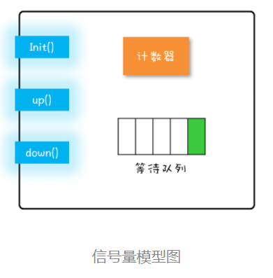
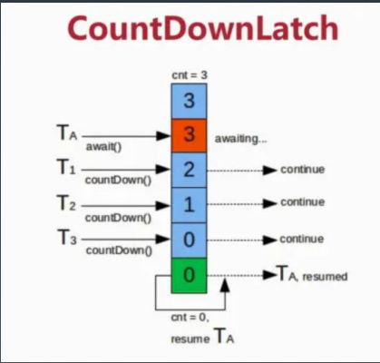
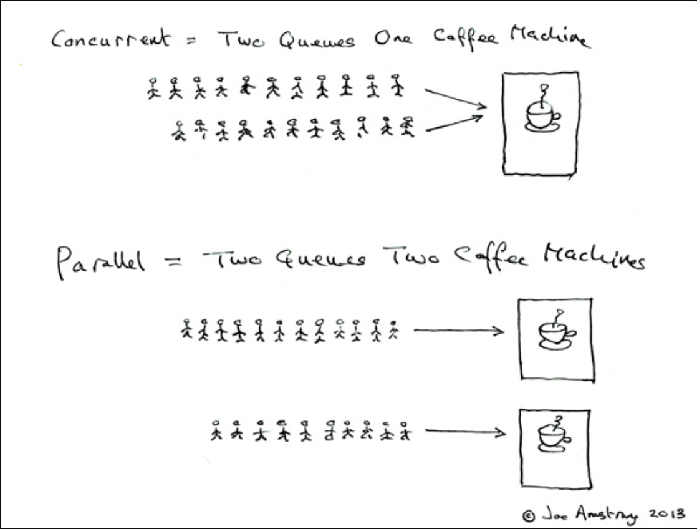
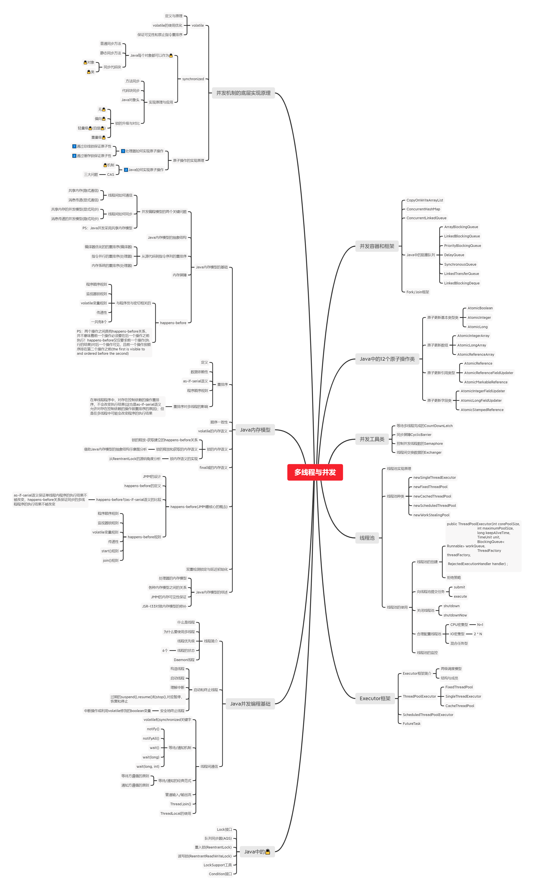

学习笔记

## 作业7-2

```
必做）思考有多少种方式，在main函数启动一个新线程或线程池，异步运行一个方法，拿到这个方法的返回值后，退出主线程？写出你的方法，越多越好，提交到github。
```

主要用了11种方法，涉及到

1. Future
2. FutureTask
3. Thread.join
4. CountDownLatch
5. Semaphore
6. CyclicBarrier
7. CompletableFuture
8. BlockingQueue
9. Thread.sleep
10. LockSupport
11. Lock&Condition

根据运行时间，耗时最长的是CompletableFuture，估计是内部太复杂...  不适合数据量少的时候...


## 作业8-1

```
（选做）列举常用的并发操作API和工具类，简单分析其使用场景和优缺点。
```

> PS：以下内容主要是参考极客时间王宝令的Java并发编程实战的第二讲并发工具类

### 1️⃣Lock和Condition

#### Lock

Java SDK 并发包通过 Lock 和 Condition 两个接口来实现管程，其中 Lock 用于解决互斥问题，Condition 用于解决同步问题(指定唤醒Condition队列里的线程)。

##### 应用场景（与Synchroinzed区别）

由于Synchronized不支持中断，超时以及无法非阻塞获取🔒，所以Lock来解决这个问题。

**1.能够响应中断**。synchronized 的问题是，持有锁 A 后，如果尝试获取锁 B 失败，那么线程就进入阻塞状态，一旦发生死锁，就没有任何机会来唤醒阻塞的线程。但如果阻塞状态的线程能够响应中断信号，也就是说当我们给阻塞的线程发送中断信号的时候，能够唤醒它，那它就有机会释放曾经持有的锁 A。这样就破坏了不可抢占条件了。**2.支持超时。**如果线程在一段时间之内没有获取到锁，不是进入阻塞状态，而是返回一个错误，那这个线程也有机会释放曾经持有的锁。这样也能破坏不可抢占条件。

**3.非阻塞地获取锁**。如果尝试获取锁失败，并不进入阻塞状态，而是直接返回，那这个线程也有机会释放曾经持有的锁。这样也能破坏不可抢占条件。

```java
// 支持中断的API
void lockInterruptibly() 
  throws InterruptedException;
// 支持超时的API
boolean tryLock(long time, TimeUnit unit) 
  throws InterruptedException;
// 支持非阻塞获取锁的API，乐观锁 CAS
boolean tryLock();
```

##### synchronized实现可见性原理

Java 里多线程的可见性是通过 Happens-Before 规则保证的，而 synchronized 之所以能够保证可见性，也是因为有一条 **synchronized 相关的规则**：synchronized 的解锁 Happens-Before 于后续对这个锁的加锁。

##### jdk锁实现可见性原理

```java
class X {
  private final Lock rtl =
  new ReentrantLock();
  int value;
  public void addOne() {
    // 获取锁
    rtl.lock();  
    try {
      value+=1;
    } finally {
      // 保证锁能释放
      rtl.unlock();
    }
  }
}
```

利用了 **volatile 相关的 Happens-Before 规则**。Java SDK 里面的 ReentrantLock，内部持有一个 volatile 的成员变量 state，获取锁的时候，会读写 state 的值；解锁的时候，也会读写 state 的值（简化后的代码如下面所示）。也就是说，在执行 value+=1 之前，程序先读写了一次 volatile 变量 state，在执行 value+=1 之后，又读写了一次 volatile 变量 state。

**根据相关的 Happens-Before 规则**：

**顺序性规则：**对于线程 T1，value+=1 Happens-Before 释放锁的操作 unlock()；

**volatile 变量规则：**由于 state = 1 会先读取 state，所以线程 T1 的 unlock() 操作 Happens-Before 线程 T2 的 lock() 操作；

**传递性规则：**线程 T1 的 value+=1  Happens-Before 线程 T2 的 lock() 操作。

```java
//简单的jdk🔒
class SampleLock {
  volatile int state;
  // 加锁
  lock() {
    // 省略代码无数
    state = 1;
  }
  // 解锁
  unlock() {
    // 省略代码无数
    state = 0;
  }
}
```

所以说，后续线程 T2 能够看到 value 的正确结果

##### 虽然Lock不会出现死锁问题，但是会出现活锁问题。

```java
class Account {
  private int balance;
  private final Lock lock
          = new ReentrantLock();
  // 转账
  void transfer(Account tar, int amt){
    while (true) {
      //可以加一个随机时间释放锁解决活锁问题
      if(this.lock.tryLock()) {
        try {
          if (tar.lock.tryLock()) {
            try {
              this.balance -= amt;
              tar.balance += amt;
            } finally {
              tar.lock.unlock();
            }
          }//if
        } finally {
          this.lock.unlock();
        }
      }//if
    }//while
  }//transfer
}
```

#### Condition

Java 采用的是管程技术，synchronized 关键字及 wait()、notify()、notifyAll() 这三个方法都是管程的组成部分。而**管程和信号量是等价的，所谓等价指的是用管程能够实现信号量，也能用信号量实现管程**。但是管程更容易使用，所以 Java 选择了管程。

Java SDK 并发包里的 Condition，Condition 实现了管程模型里面的条件变量。

Java 语言内置的管程里只有一个条件变量，而 Lock&Condition 实现的管程是支持多个条件变量的，这是二者的一个重要区别。

##### 利用两个条件变量快速实现阻塞队列

一个阻塞队列，需要两个条件变量，一个是队列不空（空队列不允许出队），另一个是队列不满（队列已满不允许入队）

```java

public class BlockedQueue<T>{
  final Lock lock =
    new ReentrantLock();
  // 条件变量：队列不满  
  final Condition notFull =
    lock.newCondition();
  // 条件变量：队列不空  
  final Condition notEmpty =
    lock.newCondition();

  // 入队
  void enq(T x) {
    lock.lock();
    try {
      while (队列已满){
        // 等待队列不满
        notFull.await();
      }  
      // 省略入队操作...
      //入队后,通知可出队
      notEmpty.signal();
    }finally {
      lock.unlock();
    }
  }
  // 出队
  void deq(){
    lock.lock();
    try {
      while (队列已空){
        // 等待队列不空
        notEmpty.await();
      }  
      // 省略出队操作...
      //出队后，通知可入队
      notFull.signal();
    }finally {
      lock.unlock();
    }  
  }
}
```

### 2️⃣Semaphore

信号量一直都是并发编程领域的终结者，直到 1980 年管程被提出来，我们才有了第二选择。目前几乎所有支持并发编程的语言都支持信号量机制

#### 信号量模型

信号量模型还是很简单的，可以简单概括为：一个计数器，一个等待队列，三个方法。在信号量模型里，计数器和等待队列对外是透明的，所以只能通过信号量模型提供的三个方法来访问它们，这三个方法分别是：init()、down() 和 up()。你可以结合下图来形象化地理解。



这三个方法详细的语义具体如下所示。

- init()：设置计数器的初始值。
- down()：计数器的值减 1；如果此时计数器的值小于 0，则当前线程将被阻塞，否则当前线程可以继续执行。
- up()：计数器的值加 1；如果此时计数器的值小于或者等于 0，则唤醒等待队列中的一个线程，并将其从等待队列中移除。

这里提到的 init()、down() 和 up() 三个方法都是原子性的，并且这个原子性是由信号量模型的实现方保证的。在 Java SDK 里面，信号量模型是由 java.util.concurrent.Semaphore 实现的，Semaphore 这个类能够保证这三个方法都是原子操作。

```java
class Semaphore{
  // 计数器
  int count;
  // 等待队列
  Queue queue;
  // 初始化操作
  Semaphore(int c){
    this.count=c;
  }
  // 
  void down(){
    this.count--;
    if(this.count<0){
      //将当前线程插入等待队列
      //阻塞当前线程
    }
  }
  void up(){
    this.count++;
    if(this.count<=0) {
      //移除等待队列中的某个线程T
      //唤醒线程T
    }
  }
}
```

信号量模型里面，down()、up() 这两个操作历史上最早称为 P 操作和 V 操作，所以信号量模型也被称为 PV 原语。另外，还有些人喜欢用 semWait() 和 semSignal() 来称呼它们，虽然叫法不同，但是语义都是相同的。在 Java SDK 并发包里，down() 和 up() 对应的则是 acquire() 和 release()。

#### 应用场景

1. 加锁
2. 控制并发线程数

### 3️⃣ReadWriteLock

所有的读写锁都遵守以下三条基本原则：

1. 允许多个线程同时读共享变量；
2. 只允许一个线程写共享变量；
3. 如果一个写线程正在执行写操作，此时禁止读线程读共享变量。

读写锁与互斥锁的一个重要区别就是读写锁允许多个线程同时读共享变量，而互斥锁是不允许的，这是读写锁在读多写少场景下性能优于互斥锁的关键。但读写锁的写操作是互斥的，当一个线程在写共享变量的时候，是不允许其他线程执行写操作和读操作。

### 4️⃣StampedLock

在读多写少的场景中，Java 在 1.8 这个版本里，提供了一种叫 StampedLock 的锁，它的性能就比读写锁还要好。

ReadWriteLock 支持两种模式：一种是读锁，一种是写锁。而 StampedLock 支持三种模式，分别是：**写锁**、**悲观读锁和乐观读**。

StampedLock 的性能之所以比 ReadWriteLock 还要好，其关键是 **StampedLock 支持乐观读**的方式。ReadWriteLock 支持多个线程同时读，但是当多个线程同时读的时候，所有的写操作会被阻塞；而 **StampedLock 提供的乐观读，是允许一个线程获取写锁的**，也就是说不是所有的写操作都被阻塞。

### 5️⃣CountDownLatch

countDownLatch这个类使一个线程等待其他线程各自执行完毕后再执行。

是通过一个计数器来实现的，计数器的初始值是线程的数量。每当一个线程执行完毕后，计数器的值就-1，当计数器的值为0时，表示所有线程都执行完毕，然后在闭锁上等待的线程就可以恢复工作了。



### 6️⃣。。。。先写到这里...


## 作业8-2

```
（选做）请思考：什么是并发？什么是高并发？实现高并发高可用系统需要考虑哪些因素，对于这些你是怎么理解的？
```

### 并发

并发：在单CPU的情况下，并发是多个任务交替使用CPU，但同一时刻还是只有一个任务在跑。

并行：多核CPU的情况下，同一时刻，不止一个CPU上有任务在跑。

Erlang 之父 Joe Armstrong 用一张5岁小孩都能看懂的图解释了并发与并行的区别



### 高并发

高并发（High Concurrency）是互联网分布式系统架构设计中必须考虑的因素之一，它通常是指，通过设计保证系统能够**同时并行**处理很多请求。

通俗来讲，高并发是指在同一个时间点，有很多用户同时的访问同一 API 接口或者 Url 地址。它经常会发生在有大活跃用户量，用户高聚集的业务场景中。

### 高并发高可用系统需要考虑哪些因素

#### 高并发指标

高并发相关常用的一些指标有响应时间（Response Time），吞吐量（Throughput），每秒查询率QPS（Query Per Second），并发用户数等。

**响应时间**：系统对请求做出响应的时间。例如系统处理一个HTTP请求需要200ms，这个200ms就是系统的响应时间。

**吞吐量**：单位时间内**处理的请求数量**。

**QPS**：每秒响应请求数。在互联网领域，这个指标和吞吐量区分的没有这么明显。

**并发用户数**：同时承载正常使用系统功能的用户数量。例如一个即时通讯系统，同时在线量一定程度上代表了系统的并发用户数。

#### 高可用

高可用HA（High Availability）是分布式系统架构设计中必须考虑的因素之一，它通常是指，通过设计减少系统不能提供服务的时间。

假设系统一直能够提供服务，我们说系统的可用性是100%。

如果系统每运行100个时间单位，会有1个时间单位无法提供服务，我们说系统的可用性是99%。

很多公司的高可用目标是4个9，也就是99.99%，这就意味着，系统的年停机时间为8.76个小时。

#### 如何提高高并发能力？

要提高响应时间，吞吐量等，可以从垂直扩展和水平扩展两方面来考虑。

**垂直扩展**：提升单机处理能力。垂直扩展的方式又有两种：

（1）**增强单机硬件性能**，例如：增加CPU核数如32核，升级更好的网卡如万兆，升级更好的硬盘如SSD，扩充硬盘容量如2T，扩充系统内存如128G；

（2）**提升单机架构性能**，例如：使用Cache来减少IO次数，使用线程池异步处理来增加单服务吞吐量，使用无锁数据结构，或者使用乐观锁等来减少响应时间；动静分离，nginx存储静态资源，tomcat处理动态请求，nginx处理静态资源的性能比tomcat高很多

**水平扩展**：只要增加服务器数量，就能线性扩充系统性能。例如搭建mysql，redis集群进行主从复制，读写分离，分库分表等等。

#### 如何提高高可用能力？

使用微服务架构，服务降级，限流，超时熔断和灰度发布等等


## 作业8-4

```
（必做）把多线程和并发相关知识带你梳理一遍，画一个脑图，截图上传到github 上。
```

下图主要是参考Java并发编程艺术整理的...
